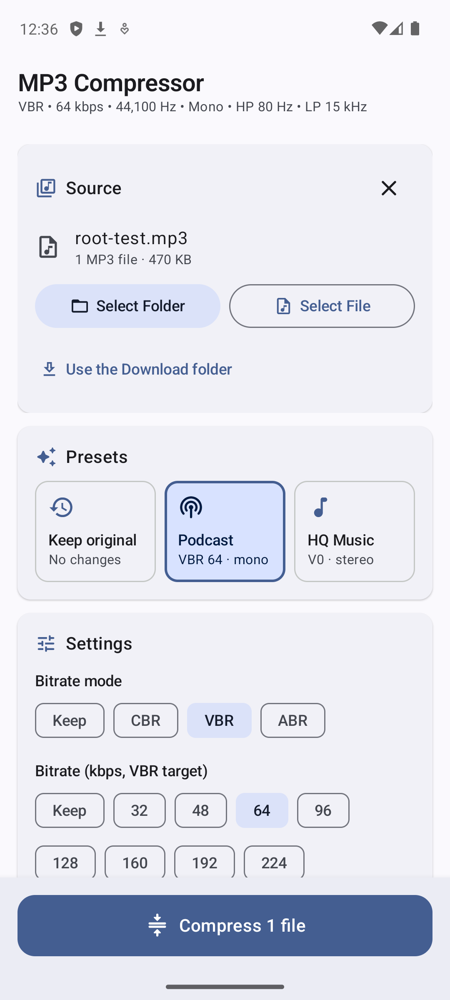
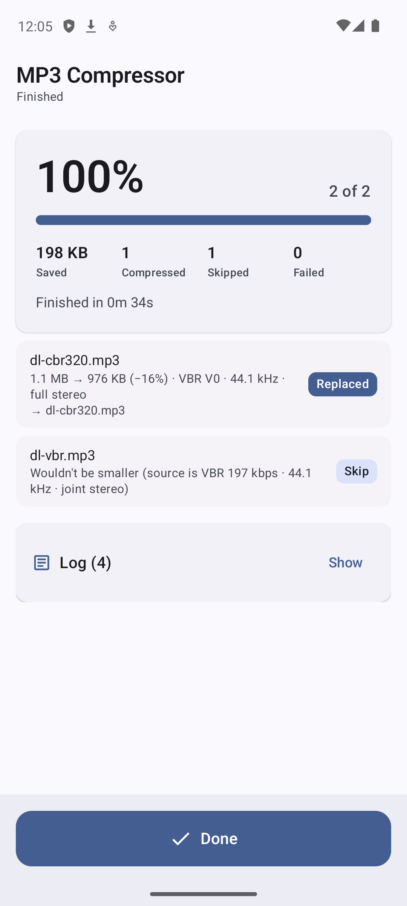

# MP3 Bulk Compressor

An Android app that shrinks MP3 files in bulk. Point it at a folder (optionally including every subfolder) or a single MP3, choose how much to compress, and it re-encodes each file with the LAME encoder. Every new file is checked before anything happens to the original.

<p align="center">
  
  &nbsp;&nbsp;
  
</p>

## Install

1. Download [`dist/MP3-Compressor-2.0.apk`](dist/MP3-Compressor-2.0.apk) to your phone (on GitHub, open the file and tap **View raw** / **Download**).
2. Open it and allow **Install unknown apps** for your browser or file manager when Android asks.
3. If Play Protect warns about an unrecognized developer, tap **More details → Install anyway**. The APK is signed with a development key rather than a Play Store key.

Requires **Android 11 or newer**.

## Using it

1. **Pick what to compress**
   - **Select Folder** finds every MP3 in the folder. Turn on **Include all subfolders** to search the whole tree.
   - **Select File** compresses one MP3. You can also open an MP3 from a file manager and choose **MP3 Compressor** under *Open with*.
   - **Use the Download folder** handles MP3s sitting directly in Download (see [Permissions](#permissions)).
2. **Choose settings**: tap a preset or set each option yourself.
3. **Choose output**
   - **Keep original, save a copy** saves `name - SHRUNK.mp3` in the same folder.
   - **Replace original** moves the original to the system Trash and gives the new file the original name.
4. Tap **Compress**. Progress shows on screen and in a notification, so you can leave the app while it works. Each file ends as **Done**, **Replaced**, **Skip** (with the reason) or **Failed** (original untouched), and the **Log** card records every step.

## Settings

Every setting has a **Keep** option that uses each file's current value. With everything on Keep (the default), no file is changed.

| Setting | Options |
| --- | --- |
| Bitrate mode | Keep, CBR, VBR, ABR |
| Bitrate (kbps) | Keep, 32, 48, 64, 96, 128, 160, 192, 224, 256, 320; plus **V0 (~245)** in VBR mode |
| Sample rate (Hz) | Keep, 8,000, 11,025, 16,000, 22,050, 32,000, 44,100, 48,000 |
| High-pass filter | Keep (off), On at 80 Hz |
| Low-pass filter | Keep (off), On at 15,000 Hz |
| Channels | Keep, Full stereo, Joint stereo, Mono |

### Presets

| Preset | Mode | Bitrate | Sample rate | High-pass | Low-pass | Channels |
| --- | --- | --- | --- | --- | --- | --- |
| Keep original | Keep | Keep | Keep | Off | Off | Keep |
| **Podcast** | VBR | 64 kbps | 44,100 | On | On | Mono |
| **HQ Music** | VBR | V0 (~245 kbps) | 44,100 | Off | Off | Full stereo |

### Rules applied to every file

- **Bitrate is never raised.** A file already at or below the chosen bitrate keeps its own bitrate; the other settings still apply.
- **Nothing is upsampled**, and a **mono file stays mono** even if a stereo option is chosen. Stereo files stay stereo unless you pick Mono.
- **Files that wouldn't get smaller are skipped**, as are files where no setting would change anything.
- **Tags and cover art are kept.** The ID3v2 and ID3v1 tags are copied byte for byte.
- In VBR mode a bitrate is a target: it's mapped to a LAME quality level (V0–V9), so actual size depends on the audio. Speech usually comes in under the target.
- **Low-pass On** never raises the encoder's own cutoff; it uses whichever is lower, 15 kHz or LAME's default for that bitrate. **Off** leaves LAME's normal bitrate-based cutoff in place.

## How files are kept safe

For each file:

1. Encode to a private temporary file.
2. Decode that file end to end and check it has the expected sample rate, channel count and length (within 0.25 s + 0.5% of the source). A damaged source that can't be fully decoded fails here.
3. Write it beside the original and read the saved copy back to confirm every byte (CRC-32).
4. Only for **Replace original**: move the original to the system Trash (restorable for 30 days, and shown in Files by Google's Trash), then rename the new file to the original name. If the Trash step isn't allowed, both files are kept and the new one keeps its ` - SHRUNK` name.

Originals are never overwritten or permanently deleted. If anything fails, a partly written output is removed and the original is left exactly as it was.

## Permissions

| Permission | Why |
| --- | --- |
| Folder access (system picker) | Reading and writing the folders you choose. No permission is needed for these. |
| **All files access** (optional, off by default) | Android's folder picker refuses the top of **Download** and of internal storage. The app asks for this only when you use **Use the Download folder** or pick a file in one of those places, and explains why first. Everything else works without it. |
| Notifications | Showing batch progress while the app is in the background. |
| Foreground service / wake lock | Keeping a long batch running with the screen off. |

The app has **no internet permission**: nothing leaves the device. App backups are disabled.

## Building from source

Requirements: JDK 17+, Android SDK with platform 34, build-tools 34.0.0, NDK 25.1.8937393 and CMake 3.22.1. Put the SDK path in `local.properties` (`sdk.dir=/path/to/sdk`).

```bash
./gradlew :app:testReleaseUnitTest   # unit tests (encode planning, MP3 header parsing, storage rules)
./gradlew :app:assembleRelease       # APK at app/build/outputs/apk/release/app-release.apk
```

The release build is minified and signed with the local debug key so it installs directly. To publish on the Play Store, set up your own signing config in `app/build.gradle.kts`.

### Project layout

```
app/src/main/
  cpp/lame/                LAME 3.100 encoder source (LGPL)
  cpp/lame_jni.c           JNI bridge: bitrate modes, filters, channel modes, Xing/LAME tag
  java/com/tdeletto/mp3bulk/
    MainActivity.kt        Compose UI: source, presets, settings, output, progress, log
    MainViewModel.kt       Source selection, folder/file access, scanning
    BatchRunner.kt         Runs a batch on worker threads, independent of the screen
    CompressService.kt     Foreground service and progress notification
    encoder/Settings.kt    Settings, presets and per-file planning rules
    encoder/Mp3Probe.kt    Reads MP3 headers: CBR/VBR/ABR, bitrate, rate, channels, tags
    encoder/Transcoder.kt  Decode → encode → verify → save → Trash/rename
    files/Scanner.kt       Folder scanning and resolving picked files
    files/Storage.kt       Storage Access Framework, MediaStore and Trash operations
```

## License

The app bundles the [LAME](https://lame.sourceforge.io/) MP3 encoder, licensed under the GNU LGPL (see `app/src/main/cpp/lame/COPYING`).
